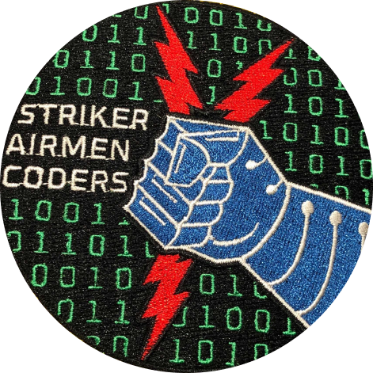

<div align="center">
  
  <p></p>
  <h1>MyDorms</h1>
  <p style="margin-top: -20px;">Express/React Starter Kit<p>
  <p></p>
</div>

# Getting Started

Copy env files
```#!bash
  cp .env.example .env
  cp backend/.env.example backend/.env
  cp frontend/.env.example frontend/.env
```

If using Docker
- Install [Docker Desktop](https://www.docker.com/products/docker-desktop)

```#!bash
  docker compose up -d
  docker compose exec postgres createdb mydorms_dev
  docker compose exec backend npx prisma db push
  docker compose exec backend npx prisma db seed
```

If using Host Machine (on MacOS)
- Install [Node.js](https://nodejs.org/en/download)
- Install [PostgreSQL](https://postgresapp.com)

```#!bash
  createdb mydorms_dev
  npm run install:all
  cd backend
    npx prisma generate
    npx prisma db push
    npx prisma db seed
  cd ..
  npm start --prefix backend
  npm start --prefix frontend
```

Visit `http://localhost:3000`

# Tech Stack
## Backend

- Language: [Javascript](https://www.javascript.com)
- Framework: [Express](https://expressjs.com)
- ORM: [Prisma](https://www.prisma.io)
- API: [REST](https://restfulapi.net)
- Authentication: [Passport](http://www.passportjs.org)
- Testing: [Jest](https://jestjs.io)
- Exceptions: [Sentry](https://sentry.io)
- Docs
  - TODO

##  Frontend

- Language: [Javascript](https://www.javascript.com)
- Framework: [Create React App](https://reactjs.org/docs/create-a-new-react-app.html#create-react-app)
- CSS: [Emotion](https://emotion.sh)
- UI Components: [Material-UI](https://material-ui.com/)
- API Client: [React Query](https://react-query.tanstack.com)
- State: [Zustand](https://zustand.surge.sh)
- Testing: [Jest](https://jestjs.io) / [Cypress](https://www.cypress.io)
- Exception Tracking: [Sentry](https://sentry.io)
- Docs
  - [💻 Application Overview](frontend/docs/application-overview.md)
  - [⚙️ Project Configuration](frontend/docs/project-configuration.md)
  - [👁️ Style Guide](frontend/docs/style-guide.md)
  - [🗄️ Project Structure](frontend/docs/project-structure.md)
  - [🧱 Components And Styling](frontend/docs/components-and-styling.md)
  - [📡 API Layer](frontend/docs/api-layer.md)
  - [🗃️ State Management](frontend/docs/state-management.md)
  - [🧪 Testing](frontend/docs/testing.md)
  - [⚠️ Error Handling](frontend/docs/error-handling.md)
  - [🔐 Security](frontend/docs/security.md)
  - [🚄 Performance](frontend/docs/performance.md)
  - [📚 Additional Resources](frontend/docs/additional-resources.md)
